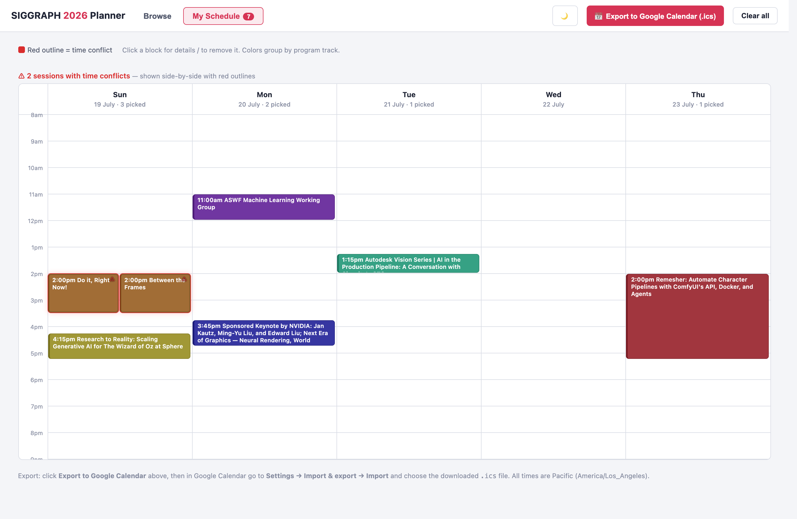
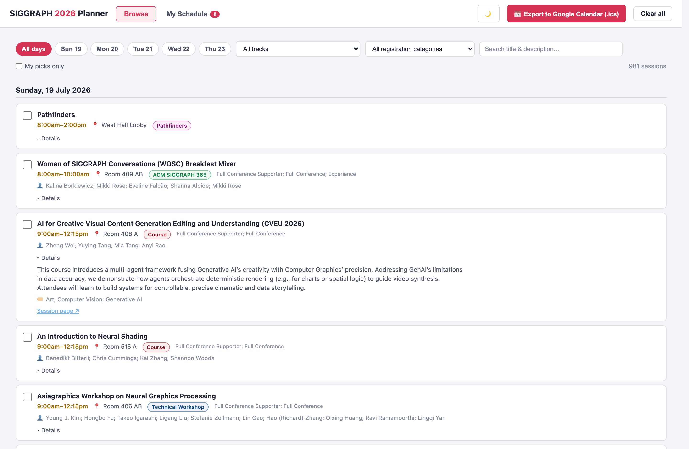

# SIGGRAPH 2026 Session Planner (unofficial)

### ⬇️ Download: [**planner.html**](https://github.com/nathanshipley/siggraph2026-planner/releases/latest/download/planner.html) — one click, one file, that's the whole app

### 🚀 Or use it live in your browser: [**nathanshipley.github.io/siggraph2026-planner/planner.html**](https://nathanshipley.github.io/siggraph2026-planner/planner.html)

A single-file, offline **personal session planner** for [SIGGRAPH 2026](https://s2026.siggraph.org/)
(Los Angeles, 19–23 July 2026), plus the full conference schedule as CSV.

Three things this has that the official schedule site doesn't:

- **📅 Time view** — your picked sessions on a five-day time-bar calendar, with overlaps flagged in red
- **🔎 Full-text search** — instantly search every session title, abstract, speaker *and* company at once
- **🏢 Filter by company** — find every session with someone from NVIDIA, Pixar, Wētā FX, your own studio…

**Just want the schedule for your own agent?** Here's a CSV:
[`siggraph2026_schedule_with_descriptions.csv`](data/siggraph2026_schedule_with_descriptions.csv)
([raw](https://raw.githubusercontent.com/nathanshipley/siggraph2026-planner/main/data/siggraph2026_schedule_with_descriptions.csv))



## Quick start

1. [Download `planner.html`](https://github.com/nathanshipley/siggraph2026-planner/releases/latest/download/planner.html)
   and double-click it — or just open the [live version](https://nathanshipley.github.io/siggraph2026-planner/planner.html).
   No install, no server; the downloaded file works offline.
2. Check sessions to build **My Schedule**, spot conflicts on the calendar, and export
   your picks to Google Calendar (`.ics`) when you're happy.

Your picks are saved in your browser (localStorage) and survive reloads.

More of what it does:

- **Browse & filter** all 1,008 sessions by day, program track, registration level (Full Conference
  Supporter / Full Conference / Experience / Discover), company, and free-text search.
- **★ Can't Miss**: star the ones that really matter. They render bold and gold in both Browse and
  the calendar, and the calendar warns you when a Can't Miss is caught in a time conflict.
- **Session groups**: Talks / Technical Papers / Educator's Forum / Art Papers blocks are linked to
  their individual presentations, exactly like the twirl-downs on the official schedule site.
- **Export to Google Calendar**: one click generates an `.ics` of your picks with correct
  `America/Los_Angeles` times (import via Google Calendar → Settings → Import & export).
- **Sync / Backup**: your picks live in one browser's localStorage — they don't follow a Chrome
  profile to another machine, and a downloaded copy and the web version are separate stores.
  So the **Sync / Backup** button gives you a link that carries your picks and ★ Can't Miss marks
  (open it on the other device) and a `.json` backup you can import anywhere. Picks are keyed on
  each session's permanent URL, so they survive the schedule being rescheduled or retitled.
- Light and dark mode.



## What's in the repo

| Path | What it is |
|---|---|
| `planner.html` | The self-contained planner app (schedule data embedded) |
| `data/siggraph2026_schedule_with_descriptions.csv` | Full schedule, 1,008 rows, incl. abstracts + affiliations |
| `data/siggraph2026_schedule.csv` | Earlier schedule snapshot without the abstract text (facts only) |
| `data/siggraph2026_exhibitors.csv` | Exhibitor list |
| `src/` | Template + build script — regenerate `planner.html` from the CSV |
| `scraper/` | `refresh_schedule.py` (see below) + the original description fetchers |

CSV columns: `day_and_date, start_time, end_time, title, program_track, location,
speakers_or_contributors, affiliations, keywords_tags, interest_area, registration_category,
session_url, description`.

`affiliations` is the set of companies/institutions for that session's contributors
(e.g. `Asteria; Filmmaker; LTX`), joined from the official contributor index.

## Data notes

- Scraped from the official schedule at
  [s2026.conference-schedule.org](https://s2026.conference-schedule.org/) on **16 July 2026**.
  The official schedule changes — always confirm times/rooms there before you commit your feet.
- All times are local Pacific (PDT).
- ~85 rows are **session-group headers** (e.g. a Talks block containing four 20-minute talks).
  On the official site these have no page of their own; in the CSV their `session_url` is the
  literal `…/null`. The planner detects these and nests their presentations automatically.
- A few rows (Exhibition, some poster groups) legitimately have no URL or abstract.

## Rebuilding the planner

```bash
python3 src/build_planner.py            # data/ CSV + src/ template -> planner.html
python3 src/build_planner.py --help     # --out, --no-seeds
```

Python 3.8+, stdlib only.

## Keeping the data fresh (cheaply)

The schedule site rate-bans bursty clients, so **don't** re-crawl 900 session pages to find out
whether anything changed. It publishes its whole program as five static per-day files, which the
Full Program page lazy-loads. `scraper/refresh_schedule.py` uses those instead:

```bash
python3 scraper/refresh_schedule.py --check   # 7 requests: what changed since the CSV?
python3 scraper/refresh_schedule.py           # + fetch only genuinely new abstracts, rewrite CSV
python3 src/build_planner.py                  # rebuild planner.html from the refreshed CSV
```

`--check` costs **7 requests** (Full Program page + 5 day snippets + the contributor index) and
reports added / removed / rescheduled / moved-room / retitled sessions. It also prints the
program's own last-regenerated timestamp, so you can see at a glance whether the site's data has
moved at all. A full refresh only fetches abstracts for sessions it hasn't seen before, one at a
time with a delay, resumable via `scraper/descriptions_cache.csv`, and it stops immediately if the
site starts refusing requests.

`scraper/fetch_descriptions.py` (and its PowerShell port) are the original brute-force abstract
fetchers, kept for reference — see `scraper/SCRAPING_NOTES.md`. Prefer `refresh_schedule.py`.

## Data & attribution

- Schedule **facts** (titles, times, rooms, speakers) are factual data, included here to help
  attendees plan.
- Session **abstracts/descriptions** were written by their respective authors and are published by
  ACM SIGGRAPH (© 2026 SIGGRAPH / the individual authors). They are reproduced here, unmodified
  and with links back to the official session pages, solely to make the conference easier to
  navigate. If you are a rights holder and want content removed, **open an issue** and it will be
  taken down promptly.
- Code (planner, build script, scrapers) is [MIT licensed](LICENSE). The license does **not**
  cover the session descriptions.

## Credits

Built by an attendee, for attendees. Have fun at the show. 🎬

---

> **Unofficial community tool.** This project is not affiliated with, sponsored by, or endorsed by
> ACM SIGGRAPH. SIGGRAPH is a registered trademark of the Association for Computing Machinery.
> All session content belongs to its authors and ACM SIGGRAPH — see [Data & attribution](#data--attribution).
